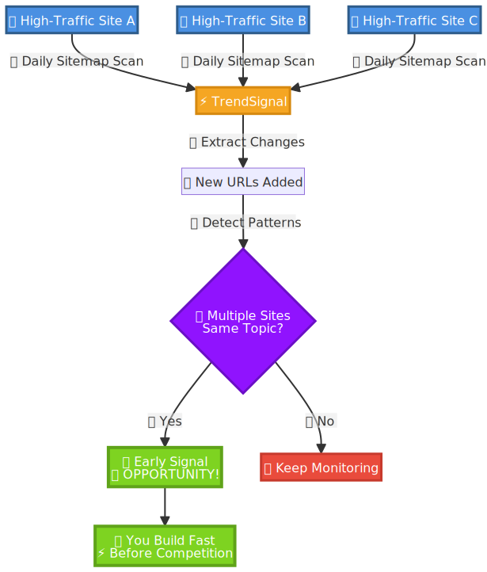

# **TrendSignal**

**Erkenne Trend-Chancen, bevor es alle anderen tun.**

Überwache täglich die Sitemaps deiner Konkurrenz. Sieh, was erfolgreiche Seiten veröffentlichen, bevor Google Trends es erfasst. Handle schnell, bei niedriger Konkurrenz.

**[Jetzt für Early Access bewerben](https://docs.google.com/forms/d/e/1FAIpQLSfDD3Al8JbeqG56_6QbeZVOYJLNM70vn-SKFo45zWJPTqnHlg/viewform?usp=header)**

---

## **Der Vorsprung**

Google Trends zeigt dir, was bereits im Trend liegt. Zu spät—die Konkurrenz ist hoch.

Aber Traffic-starke Seiten? Ihre Sitemaps sind Frühindikatoren. Wenn sie neue Seiten zu aufkommenden Themen hinzufügen, geschieht das *bevor* Trends offensichtlich werden.

**Die Erkenntnis:** Wenn mehrere erfolgreiche Seiten ihre Sitemaps innerhalb weniger Tage mit Seiten zum selben Thema aktualisieren—das ist dein Signal. Handle, solange das Zeitfenster offen ist.

---

## **So funktioniert es**

**Was du bekommst:**

- Tägliche Sitemap-Diff-Reports—exakte URLs, die von überwachten Seiten hinzugefügt wurden
- Gemeinsamer Pool kuratierter Traffic-starker Domains (bereits im Tracking)
- Mustererkennung, wenn mehrere Seiten zum selben Thema aktiv werden
- Möglichkeit, Domains zum Monitoring-Pool hinzuzufügen

**Der Vorteil:** Profitiere von der Recherche erfolgreicher Betreiber. Sie erkennen Trends, du siehst ihre Bewegungen, du handelst zuerst.

---

## **Beispiel**

Du überwachst 20 Gaming-Seiten. Drei davon fügen innerhalb von 48 Stunden Seiten zu einem neuen Spiel zu ihren Sitemaps hinzu.

Das ist kein Zufall. Sie haben etwas früh erkannt.

**Dein nächster Schritt:** Prüfe das Keyword. Noch geringe Konkurrenz? Baue und launche, während Google Trends noch keine Daten zeigt.

Das funktioniert in jeder Nische, wo Content sich schnell bewegt.

---

## **Jetzt für Early Access bewerben**

Aktuell kostenlos. Baue das mit einer kleinen Gruppe früher Nutzer auf.

Sag mir:
- In welcher Nische du tätig bist
- Welche Domains du zur Überwachung vorschlagen würdest

Ich prüfe es und antworte.

**[Jetzt bewerben](https://docs.google.com/forms/d/e/1FAIpQLSfDD3Al8JbeqG56_6QbeZVOYJLNM70vn-SKFo45zWJPTqnHlg/viewform?usp=header)**

---

*MVP-Phase. Nur kleine Gruppe. Lass uns das gemeinsam aufbauen.*
