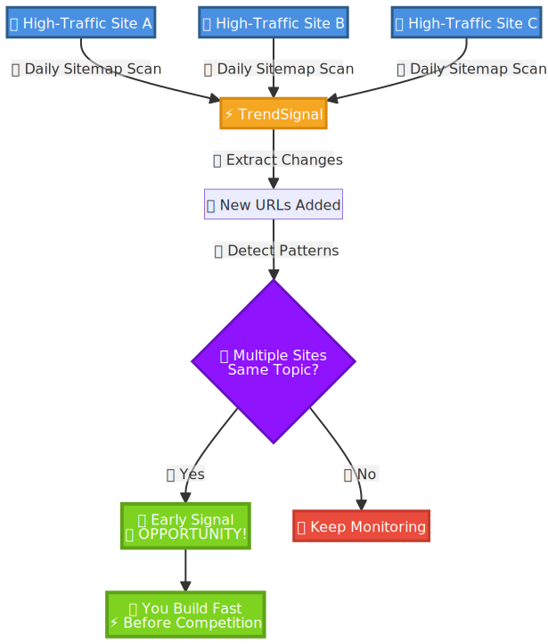

# **TrendSignal**

**比别人更早发现趋势机会。**

每天监控竞品网站的 sitemap，看看那些成功的网站在发布什么内容——在 Google Trends 发现之前。动作快，竞争小。

**[申请提前体验](https://docs.google.com/forms/d/e/1FAIpQLSfDD3Al8JbeqG56_6QbeZVOYJLNM70vn-SKFo45zWJPTqnHlg/viewform?usp=header)**

---

## **优势在哪**

Google Trends 显示的是已经在火的东西。那时候已经晚了——竞争很大。

但大流量网站不一样，它们的 sitemap 是早期信号。当它们为新兴话题添加新页面时，这发生在趋势明显*之前*。

**关键点：** 当好几个成功网站在几天内都更新 sitemap，添加同一个话题的页面——这就是信号。趁窗口期还在，赶紧行动。

---

## **怎么运作**

**你能得到什么：**

- 每日 sitemap 变化报告——监控网站新增的具体 URL
- 已精选好的大流量域名池（正在跟踪中）
- 多个网站对同一话题有动作时的规律识别
- 可以提交域名加入监控池

**为什么有用：** 借用成功玩家的研究。他们发现趋势，你看到他们的动作，你先出手。

---

## **举个例子**

你在监控 20 个游戏网站。有三个网站在 48 小时内把一款新游戏的页面加到了 sitemap 里。

这不是巧合。他们肯定提前发现了什么。

**你该做什么：** 去查这个关键词。竞争度还低？那就趁 Google Trends 还没数据的时候，做出来上线。

任何内容更新快的领域都适用。

---

## **申请提前体验**

目前免费。正在和一小批早期用户一起构建这个产品。

告诉我：
- 你在做什么领域
- 你觉得应该监控哪些网站

我会仔细审核后，一一回复。

**[马上申请](https://docs.google.com/forms/d/e/1FAIpQLSfDD3Al8JbeqG56_6QbeZVOYJLNM70vn-SKFo45zWJPTqnHlg/viewform?usp=header)**

---

*MVP 阶段，小范围测试。一起来。*
